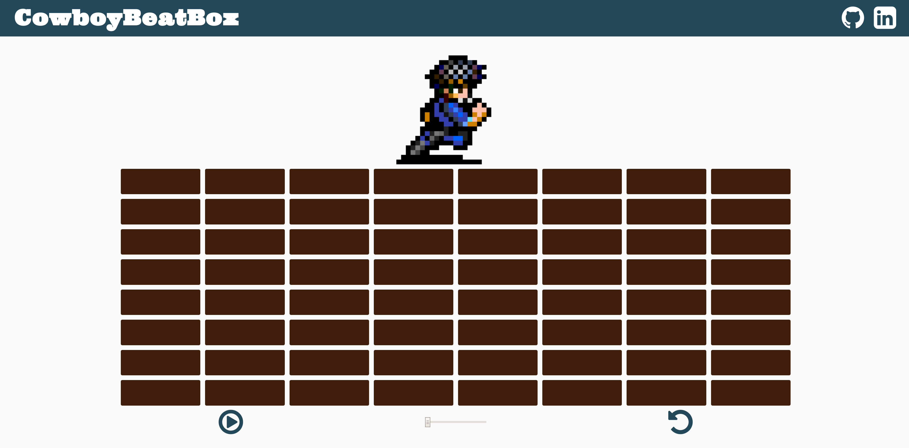

## CowboyBeatBox

### Background

[Live Link] :https://theroyaltnetennba.github.io/cowboyBeatBox/

CowboyBeatBox is a browser-based beatboxing app. It has a general layout and structure similar to others, with the added functionality of an avatar who dances to the user-specified beats.

This app incorporates all of the basic beatboxing features with a few additions, outlined in the **Functionality & MVP** and **Bonus Features** sections.  

### Functionality & MVP  

Users are able to:

- [ ] Select squares from a grid that represent different sounds and timings
- [ ] Watch Spike dance
- [ ] Set tempo

### Screenshots

This app consists of a single screen with a grid of buttons, a tempo bar,  basic controls, and nav links to the Github, my LinkedIn. Game controls include Start, Pause, and Reset buttons as well as a slider to control the tempo.

### Architecture and Technologies

This project was implemented with the following technologies:

- Vanilla JavaScript (ES6) for overall structure and game logic,
- `HTML5 Canvas` for DOM manipulation and rendering,
- Webpack to bundle and serve up the various scripts.
- Audacity for sound samples
- Piskel for sprite images0

In addition to the webpack entry file, there are three scripts involved in this project:

`board.js`: this script will handle the logic for creating and updating the necessary `HTML5 Canvas` elements and rendering them to the DOM.

`index.js`: this script imports content from the other scripts and initializes them.

`spike.js`: this script will receive the data prepared by `board.js` and `cowboyBeatBox.js` to render spike's dancing.

### Implementation Timeline

**Day 1**: Setup all necessary Node modules, including getting webpack up and running.  Create `webpack.config.js` as well as `package.json`.  Write a basic entry file and the bare bones of all 3 scripts outlined above.  Learn the basics of `Canvas HTML5`.

**Day 2**: Prepared basic UI and styling. Complete HTML skeleton with CSS stylings. Set appropriate onclick events for html elements.

**Day 3**: Built logic and visualizations for BeatBox portion. Build tempo functionality and select sound clips.

**Day 4**: Gave Spike all the dance moves he needs to succeed. Draw sprites and correctly time their rendering with canvas.

### Bonus features

Some of the possible add-on features include:

- [ ] Using Web Speech API to sing/rap user input to a given beat.
- [ ] Adding the option to select from different Cowboy Bebop characters
